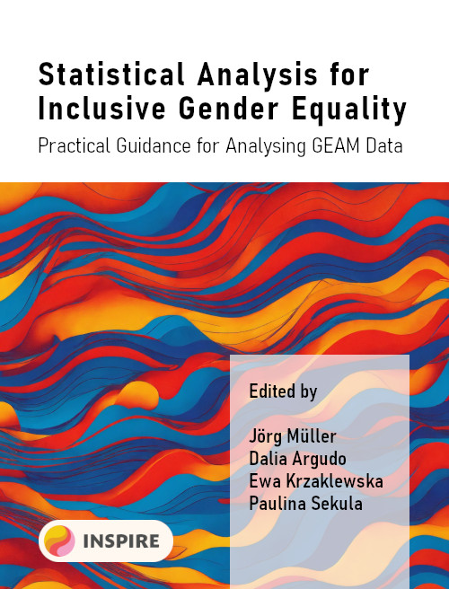

# Statistical Analysis for Inclusive Gender Equality

This book offers practical, in-depth guidance on analyzing data collected through the Gender Equality Audit and Monitoring (GEAM) questionnaire. It aims to inspire and equip users to move beyond basic descriptive statistics, encouraging deeper exploration of the thematic issues underlying gender equality.

It is intended for members of gender equality working groups, including professionals, gender specialists, administrative staff, and other stakeholders who have collected data using GEAM in their organisations but are uncertain about how to analyse it in greater depth.

Ideally, this book serves as a starting point for fostering dialogue among equality practitioners, data and statistical experts, employees, and students about gender and other forms of inequality within their organizations. We hope it will be both engaging and valuable—offering statisticians insights into gender issues, while supporting gender equality practitioners in developing their skills in quantitative data analysis.

## What is the GEAM tool?

The **Gender Equality Audit and Monitoring (GEAM)** tool is a survey framework to collect robust and reliable data on gender equality from both employees (academic and administrative) and students in research and innovation organisations. Its goal is to analyse perceptions and experiences related to discrimination, working conditions, harassment, job satisfaction, and other key areas, complementing the information provided by traditional administrative data. More information on the GEAM tool and how to use it, please consult the [GEAM Manual](https://geamtool.eu/manual)

## Funding

This work has received funding under the European Union's Horizon Europe research and innovation programme under grant agreement No 101058537.

## Book cover

{width="152"}
